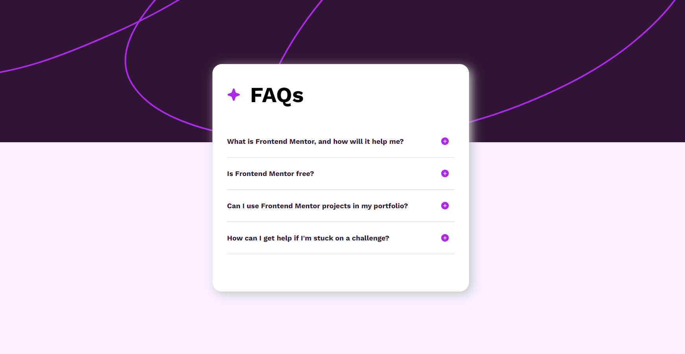
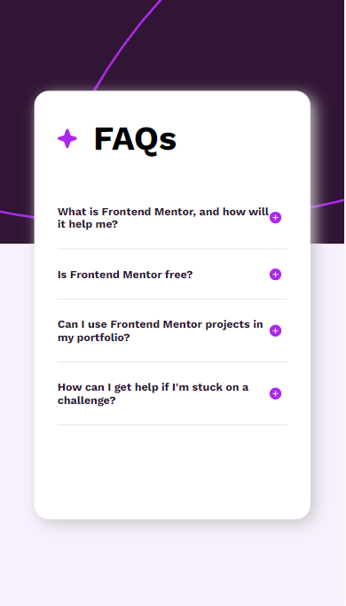

# FAQ accordion solution

This is a solution to the [FAQ accordion challenge on Frontend Mentor]

## Table of contents

- [Overview](#overview)
  - [The challenge](#the-challenge)
  - [Screenshot](#screenshot)
  - [Links](#links)
- [My process](#my-process)
  - [Built with](#built-with)
- [Author](#author)

## Overview

### The challenge

Users should be able to:

- Hide/Show the answer to a question when the question is clicked
- Navigate the questions and hide/show answers using keyboard navigation alone
- View the optimal layout for the interface depending on their device's screen size
- See hover and focus states for all interactive elements on the page

### Screenshot

### Links

- Solution URL: [Solution URL here](https://github.com/SOBAN7AKRAM/FAQ-Accordion)
- Live Site URL: [Live site URL here](https://soban7akram.github.io/FAQ-Accordion/)

## My process

### Built with

- Semantic HTML5 markup
- CSS custom properties
- Flexbox
- JavaScript

## Author

- Facebook - [M Soban Akram](https://www.facebook.com/msnbanch.soban?mibextid=ZbWKwL)
- Frontend Mentor - [@SOBAN7AKRAM](https://www.frontendmentor.io/profile/SOBAN7AKRAM)
